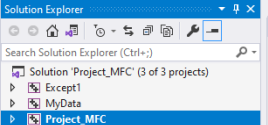
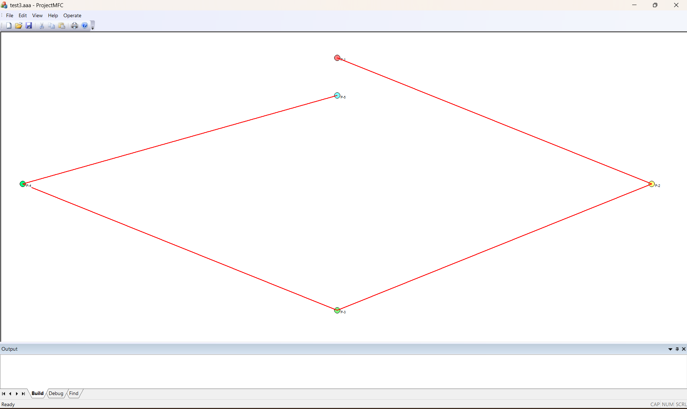
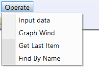
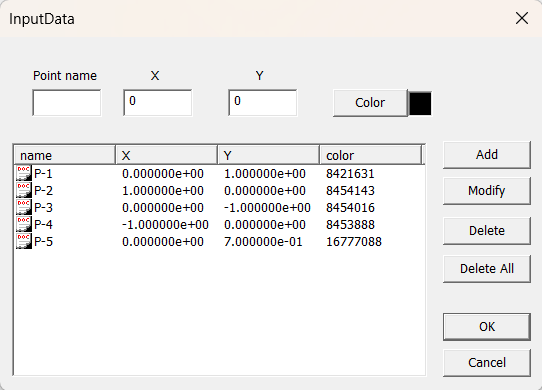

Projekt przewiduje stworzenie kontenera na podstawie techniki szablonów C++ przy użyciu interfejsu graficznego GDI pod systemem operacyjnym Windows.

## Generalna struktura projektu

- *Solution* składa się przynajmniej z trzech projektów (modułów) Visual Studio (VS) – Rys 1.

	
	*Rys. 1 Struktura rozwiązania*

- Moduł **Project_MFC** zabezpiecza obsługę GDI w postaci okna graficznego, menu, paneli narzędzi (toolbars), wierszy tekstowych oraz wszystkich niezbędnych dialogów dla wprowadzenia, modyfikacji, usunięcia danych oraz wszystkich operacji wymienionych w Rozdziale 2. Ten projekt generuje plik z rozszerzeniem `*.exe`.

- Moduł **MyData** realizuje obsługę danych (serwer danych), nie posiada interfejsu GDI, jednak realizuje wszystkie operacji nad danymi. Generuje dynamicznie wiązaną bibliotekę `*.dll`, która eksportuje swoje klasy do wszystkich innych modułów.

- Moduł **Except1** realizuje obsługę błędów i komunikatów i eksportuje się do modułów *MY_DATA* oraz *Project_MFC*. Jest to MFC dll. W przypadku błędu fatalnego **Except1** powinien skończyć wykonanie aplikacji. W przypadku komunikatu posyła komunikat windowsowy do *CMainFrame* modułu *Project_MFC*, który powinien być przechwycony i opracowany. Jako skutek, ten komunikat powinien pojawić się w oknie *Output*.
 
- Na Rys. 2 jest przedstawiony przykład aplikacji GDI dla obsługi tablicy dynamicznej przechowującej punkty na płaszczyźnie ze współrzędnymi x, y. Okno graficzne wyświetla te dane. Menu `Operate` zawiera dwie opcje (Rys. 3). Przy naciskaniu na `Input Data` otwiera się dialog (Rys. 4), który umożliwia dodawanie punktu, modyfikacje współrzędnych punktu oraz usunięcie punktu. Przy naciskaniu na `Graph Wind` powstaje dialog, sterujący opcjami wyświetlania danych na ekranie graficznym – promieniem punktu, jego kolorem, typem i wielkością ścianki, trybem linii łączących punkty itd.


*Rys. 2 Aplikacja GDI, która realizuje obsługę tablicy dynamicznej przechowującej punkty na płaszczyźnie ze współrzędnymi x, y*


*Rys. 3 Opcje Operate*


*Rys. 4 Dialog „Input Data”*

## Moduł danych

1. W klasie `MY_DATA` stworzyć tablicę dynamiczną typu `MY_POINT`. Każdy obiekt `MY_POINT` przedstawia punkt na płaszczyźnie dziedziczy po klasie `MY_COORD` ze współrzędnymi `double x, y`. `MY_POINT` zawiera nazwę punktu `char *name`, jego numeru `int numb` oraz kolor dla wyświetlania graficznego `COLORREF color`. Klasa `MY_DATA` eksportuje się do *Project_MFC*.

	Dopisać metodę: 
	- `clear_all` – usunięcie wszystkich elementów tablicy
	-  Zrealizować zapis-odczyt danych do/z pliku binarnego przy użyciu standardowych okien Windows `Open` and `Save As`.
	-  Przeciążyć operator `[]` dla pobrania i przypisania elementu tablicy `dat[ind]` o indeksie `ind`
    
2. Stworzyć funkcje – szablon `Find`:

	```
	template <class T, class Key>
	T * find(const T *p_begin, const T *p_end, const Key &k);
	```

	Tu – `p_begin` – wskaźnik do pierwszego elementu tablicy, z którego się zaczyna przeszukiwanie; `p_end` – pierwszy element poza ostatnim elementem tablicy; `Key k` – klucz przeszukiwania (dla podanego przykładu – nazwa wierzchołku). Zwraca wskaźnik do odnalezionego elementu tablicy lub `NULL` (w przypadku niepowodzenia).

3. Układ obsługi błędów, ostrzeżeń i komunikatów `MyExcept1` przedstawić oddzielną klasą. Wszystkie błędy, ostrzeżenia i komunikaty muszą być umieszczone w jednym pliku, a nie rozrzucone po kodzie. Zakończenie awaryjne aplikacji powinno być „inteligentnym” – przed zakończeniem powinni być wywołane destruktory klas, pliki pozamykane.

4. Dynamiczną alokacje/zwolnienie pamięci dokonywać przez operatory `new`/ `delete` 

5. Opcje powinny zawierać:
	- Dodawanie obiektu
	- Pobieranie ostatniego obiektu i wyświetlanie jego składowych
	- Usuwanie obiektu
	- Usuwanie wszystkich obiektów
	- Wybieranie dowolnego obiektu i modyfikowanie go
	- Znajdowanie wszystkich obiektów (po numeru wierzchołka – możliwe, że kilka obiektów mogą mieć ten sam numer)
	- Zapisać dane do pliku binarnego
	- Odczytać dane z pliku binarnego
	- Wyświetlić dane
	- Skończyć aplikacje

6. Każdą klasę umieścić w oddzielne pliki `*.cpp`, `*.h`

7. Przedstawić projekt w postaci elektronicznej jako archiwum projektu razem z plikiem danych

8. Zadanie powinno być wykonane w środowisku IDE VS 2019 – 2022 pod systemem operacyjnym Windows 10 (11)